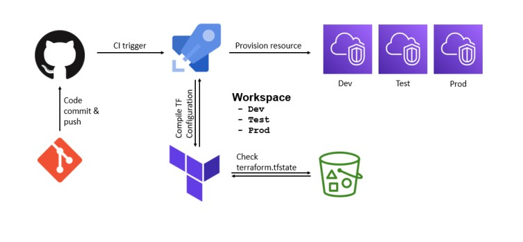
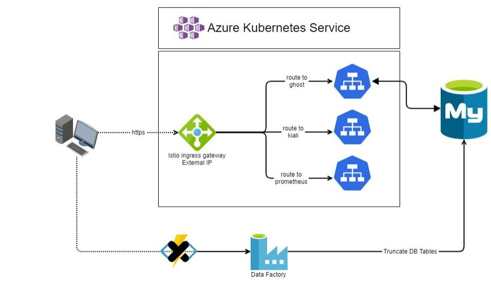

# Presentation

Click this link for presentation https://kaushikbishnu.github.io/ghost-nordcloud/

# Ghost Blog

Click this link for the deployed blog http://20.83.140.109/

# POC Continuous Integration

> Please check the presentaion link for Target Architectures

# POC Architecture

> Please check the presentaion link for Target Architectures

# Kiali

Click this link for the deployed blog http://20.83.140.109/kiali

# Grafana

Click this link for the deployed blog http://20.83.140.109:15021/

# Development Instructions

### This POC is using Terraform Cloud 
>I am using  for running terrafomrm scripts.
Terraform Cloud does not supprt -var-file argument.
It automatically takes variables form *.auto.tfvars files.
Hence I kept only one tfvars file. Ideally I will create a directory structure for supplying {env}.tfvars

### What is where?

    
    ├── [docs]                              # reveal.js presentation
    ├── [iac-ghost-project]                 # Terraform Deplyment in Azure Devops
        ├── [.ssh]                          # ssh keystore 
        ├── [ci]                            # Azure Devopos CI pipeline
        ├── [modules]                       # terraform modules for IAC k8s/mysql/keyvault            
        ├── [scripts]                       # startup script for Terraform Cloud
        ├── [terraform.d]                   # terraform cloud generated files
        ├── backend.tf                      
        ├── dev.auto.tfvars                 # tfvars file for terrafomr cloud
        ├── main.tf
        ├── providers.tf
        ├── variables.tf
    ├── [k8s-ghost-helm]                    # Helm Charts and CI for ghost app     
        ├── [ci]
        ├── [ghost-nordcloud]               # Helm charts
        ├── [scripts]                       # scripts for local helm deployments

# Data Factory git repo

A data Factory pielines is used to reset data. This is for Demo purpose, I wanted to check if I can truncate whole DB.
We can change this to Truncate only selected tables.

Plan is to trigger this pipeline from 
    - Azure Function : if a server less function is required
    - Create a event trigger : If a event based trigger is required

https://github.com/kaushikbishnu/nordcloud_assesment

# Before you see the code

    IMPORTAT NOTES (taking leverage of this being a POC)
    
    - I have not considered TLS security for this application 
      becaue of lack of time, although I have implemented ISTIO 
      to have the provision for the security to be implemented 
      as a side car

    - I have not done any CMK encryption in any of the Azure Services
    - There are passwords added as plain text in the git, I did not really like doing it but I did not wanted to spend time on implementing csi secret store provider as a part of this POC

      

